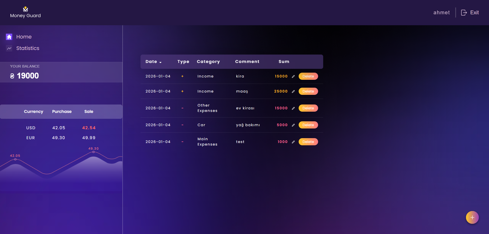

# 💰 MoneyGuard

\

**Money Guard**, GuardiansOfMoney
tarafından geliştirilen, gelir ve giderlerinizi kolayca takip etmenizi sağlayan kullanıcı dostu bir finans yönetim platformudur. Bütçenizi yönetin ve finansal durumunuzu tek bir yerden kontrol altında tutun. 📊

Canlı demo: [Projeyi Görüntüle](https://guardians-of-money-project.vercel.app/login)

## 🧱 Kullanılan Teknolojiler

Aşağıdaki teknolojiler ile proje geliştirilmiştir:

| Teknoloji             | Kullanım Amacı                              |
| --------------------- | ------------------------------------------- |
| **React**             | UI bileşenleri oluşturma                    |
| **React Router**      | Sayfa yönlendirme ve route yönetimi         |
| **Redux Toolkit**     | Global state (durum) yönetimi               |
| **PostgreSQL**        | Veritabanı yönetimi                         |
| **Chart.js**          | Grafik ve veri görselleştirme               |
| **Vite**              | Hızlı geliştirme ve build aracı             |
| **CSS / HTML**        | Stil ve temel yapı                          |
| **npm**               | Paket yönetimi                              |
| **ESLint / Prettier** | Kod stil standartları                       |
| **Vercel**            | Deployment                                  |

## 🧠 Mimari / Teknik Detaylar

📌 React + Vite

Bu proje React fonksiyonel bileşenleri ve Vite tabanlı hızlı geliştirme aracını kullanır.
Vite, build süresini kısaltır ve modüllerin hızlı yüklenmesini sağlar.

📌 Bileşen Yapısı

- components/ → Yeniden kullanılabilir UI parçaları
- pages/ → Uygulama sayfaları (Login, Register, Dashboard)
- services/ → Veri işlemleri, API bağlantıları

## 📊 Uygulama Özellikleri

Uygulama, temel finans yönetimi özelliklerini sunmaktadır.

- Gelir ekleme ve gider ekleme
- Gelir / gider listesi görüntüleme
- Bütçe bakiyesi hesaplama
- Kullanıcı arayüzü üzerinden finansal özet

## 🤝 Katkıda Bulunma

Bu proje topluluk katkılarına açıktır!
Katkıda bulunmak için:

1. Depoyu fork’la
2. Yeni bir branch oluştur (feature/isim)
3. Değişiklik yap ve commit’le
4. Pull request gönder
